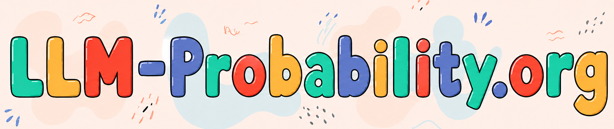

An interactive educational web application that makes the probabilistic nature of Large Language Models (LLMs) transparent and accessible, designed for middle school students and educators (non-experts without coding experience).

An interactive educational web application that makes the probabilistic nature of Large Language Models (LLMs) transparent and accessible, designed for middle school students and educators (non-experts without coding experience). 

## Associated Curriculum
This software was developed as part of a three-session educational unit designed to teach middle school students how LLMs generate text through probability and sampling. 

You can find the full curriculum, including slide decks, worksheets, and offline activities, in the main curriculum repository:

**Curriculum Repository:** [LLM-Probability Educational Materials](https://github.com/saniavn/LLM-Probability/tree/main)

## Credits
This work was developed by [Saniya Vahedian Movahed](https://saniavn.github.io/) and [David Touretzky](https://www.cs.cmu.edu/~dst/).
